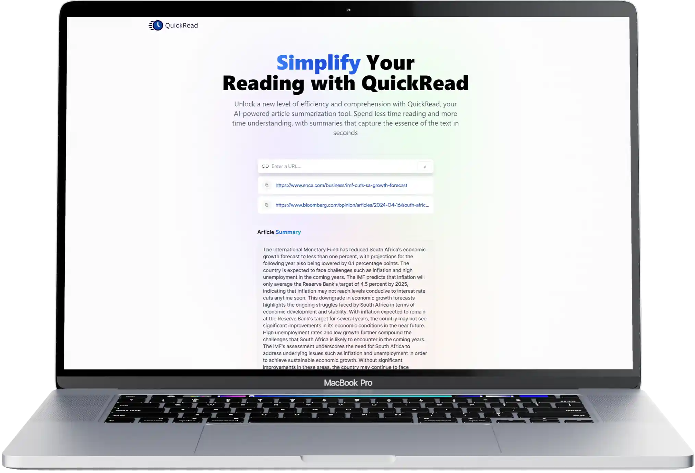

<h1 align='center'>QuickRead</h1>

QuickRead is an AI-powered web application that leverages OpenAI's powerful GPT-4 model to provide users with seamless article summarization. Easily generate concise summaries of any article, saving time and enhancing comprehension. Additionally, access your most recently summarized articles instantly, with the convenience of local storage persistence.

## Usage:

You may want to use the live version of QuickRead: https://quickread-ai.netlify.app/

1. Clone the repository:
   `git clone https://github.com/NikeshCohen/QuickRead.git`
2. Cd into the project:
   `cd QuickRead`
3. Set up your env file with a api key from [Rapid api](https://rapidapi.com/restyler/api/article-extractor-and-summarizer)
   `VITE_Rapid_API_Key=your_api_key`
4. Install the dependencies and run the application:
   `npm install`
   `npm run dev`
